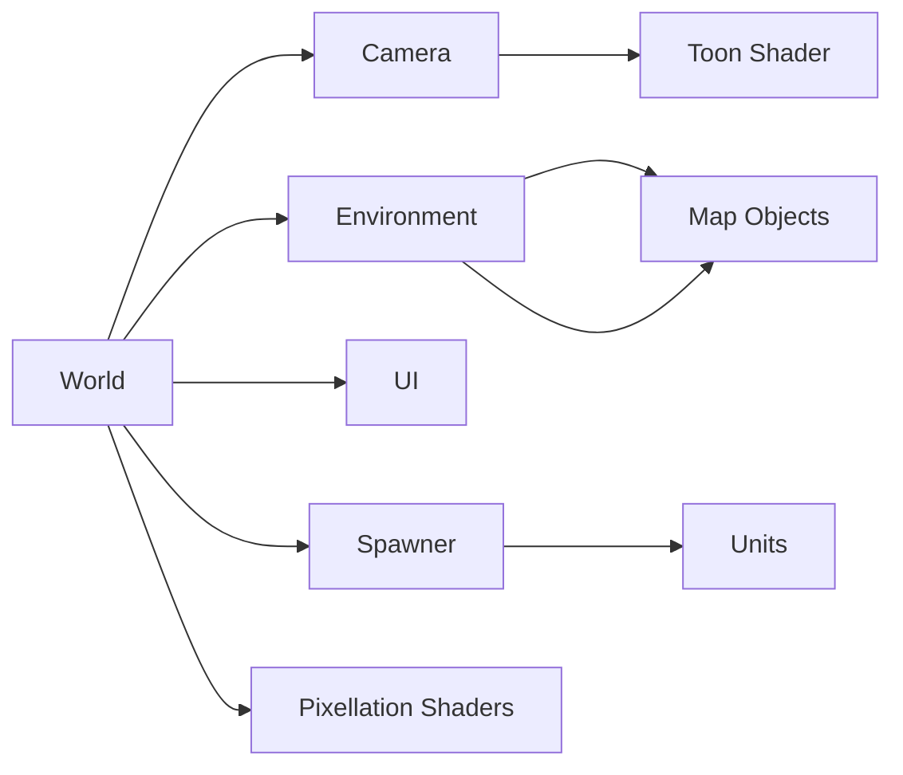

# An attempt to a Real Time Strategy game with Godot

This is mostly a tech exploration and no super-specific goal is there yet. For now the point is to:
- Create a functioning RTS-like system, with movable units and basic combat, as well as buildings and resources.
- Try to import files from my 3d-printable assets into a game engine
- Use materials rather than textures for a low-poly effect without too much hassle
- Handle animations (as few as possible, i'd rather code the movement of separate parts via code) and VFX
- Play with shaders for edge outlines and pixellation

## Installation
The project should be easy to initialize: clone the project, and open the project.godot file in [Godot 4.x](https://godotengine.org/download/]).
The selecteod scene should be world.tscn, and it starts with F5

## Functionalities
[TODO]

## Architecture

## License
The software code is licensed under the [MIT license](LICENSE-MIT).
